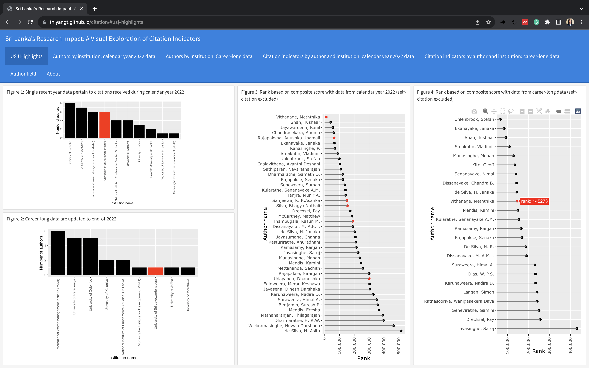
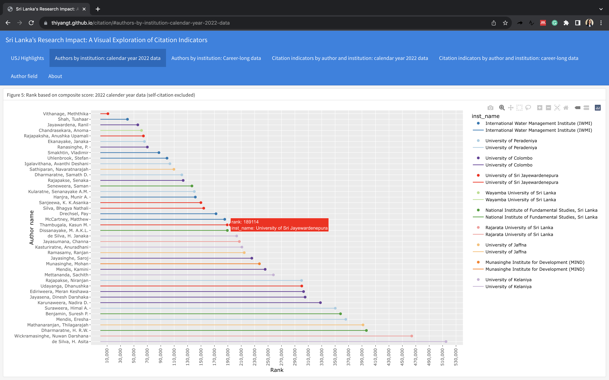
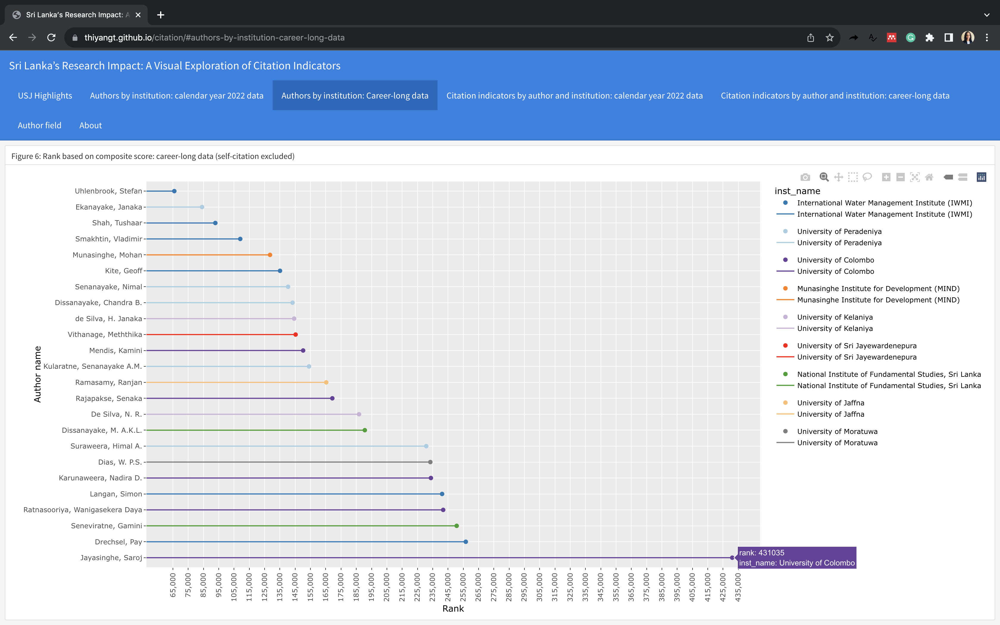
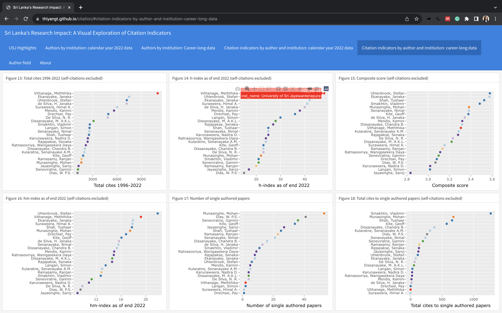
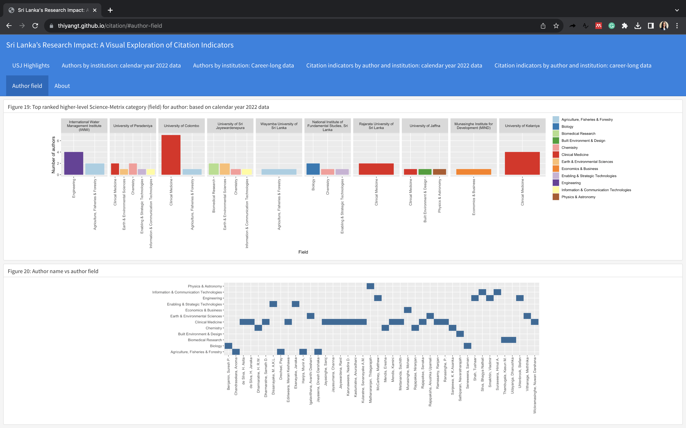

<!-- README.md is generated from README.Rmd. Please edit that file -->

## Sri Lanka’s Research Impact: A Visual Exploration of Citation Indicators

On October 4, 2023, Elsevier released an updated dataset titled “Updated
Science-Wide Author Databases of Standardized Citation Indicators,”
following a comprehensive analysis conducted by a team of experts led by
Professor John P. A. Ioannidis from Stanford University in the United
States. The results of this analysis yielded two distinct datasets:

1.  Career-long data, updated to encompass information until the end
    of 2022.
2.  Single recent year data, focusing on citations received during the
    calendar year 2022.

The study recognized 50 authors affiliated with 11 Sri Lankan
universities and institutions. The primary objective of this dashboard
is to provide a visual overview of authors and institutions based on
various criteria, including their ranking, field of expertise, and
citation metrics, such as total citations, h-index, hm-index, composite
score, the number of single-authored articles, and citations to
single-authored papers.

Link to the dashboard:
<https://thiyangt.github.io/citation/#usj-highlights>

## Dashboard panels

### Panel 1 information: USJ Highlights

Link: <https://thiyangt.github.io/citation/#usj-highlights>

Figure 1: Number of authors by institutions based on single recent year
data pertain to citations received during calendar year 2022

Figure 2: Number of authors by institutions based on Career-long data
are updated to end-of-2022

Figure 3: Author rank based on composite score with data from calendar
year 2022 (self-citation excluded)

Figure 4: Author rank based on composite score with data from
career-long data (self-citation excluded)

## Panel 2: Authors by institution: calendar year 2022 data

Link:
<https://thiyangt.github.io/citation/#authors-by-institution-calendar-year-2022-data>

Authors by institution (authors are ordered according to the their rank
based on composite score: 2022 calender year data (self-citation
excluded))

### Panel 3: Authors by institution: Career-long data

Link:
<https://thiyangt.github.io/citation/#authors-by-institution-career-long-data>

Authors by institution (authors are ordered according to the their rank
based on career-long data (self-citation excluded))

### Panel 4: Citation indicators by author and institution: calendar year 2022 data

Link:
<https://thiyangt.github.io/citation/#citation-indicators-by-author-and-institution-calendar-year-2022-data>

Figure 7: Total cites in 2022 (self-citations excluded)

Figure 8: h-index as of end 2022 (self-citations excluded)

Figure 9: Composite score (self-citations excluded)

Figure 10: hm-index as of end 2022 (self-citations excluded)

Figure 11: Number of single authored papers

Figure 12: Total cites to single authored papers (self-citations
excluded)

### Panel 5: Citation indicators by author and institution: career-long data

Link:
<https://thiyangt.github.io/citation/#citation-indicators-by-author-and-institution-career-long-data>

Figure 13: Total cites 1996-2022 (self-citations excluded)

Figure 14: h-index as of end 2022 (self-citations excluded)

Figure 15: Composite score (self-citations excluded)

Figure 16: hm-index as of end 2022 (self-citations excluded)

Figure 17: Number of single authored papers

Figure 18: Total cites to single authored papers (self-citations
excluded)

### Panel 6: Author field

Link: <https://thiyangt.github.io/citation/#author-field>

Figure 19: Top ranked higher-level Science-Metrix category (field) for
author: based on calendar year 2022 data

Figure 20: Author name vs author field

### Panel 7: About

References and dashboard development
